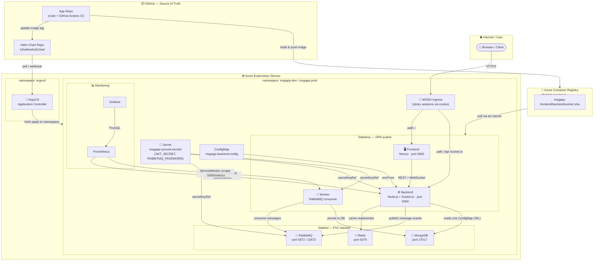

# msgapp-helm

Helm Chart for msgapp - A real-time messaging application with GitOps deployment.

## Architecture



### Traffic Flow

| Step | What happens |
|------|-------------|
| 1 | User hits `msgapp.example.com` |
| 2 | NGINX Ingress checks path |
| 3a | `/` → Frontend pod (ClusterIP:3000), sticky cookie set |
| 3b | `/api` or `/socket.io` → Backend pod (ClusterIP:5000), same sticky cookie |
| 4 | Backend checks Redis cache; on miss reads MongoDB |
| 5 | On new message, Backend **publishes** to RabbitMQ |
| 6 | Worker **consumes** from RabbitMQ → persists to MongoDB |

### Components

| Component | Kind | Replicas (prod) | Notes |
|-----------|------|-----------------|-------|
| Frontend | Deployment | 3–20 (HPA) | Next.js, port 3000 |
| Backend | Deployment | 3–20 (HPA) | Node.js + Socket.io, port 5000 |
| Worker | Deployment | 2–10 (HPA) | No HTTP port, consumes RabbitMQ |
| Redis | Deployment | 1 | ephemeral `emptyDir`, AOF on |
| RabbitMQ | StatefulSet | 1 | 5Gi PVC |
| MongoDB | StatefulSet | 1 | 50Gi PVC in prod |

## Quick Start

### Prerequisites

- Kubernetes cluster
- Helm 3
- kubectl configured

### Install

```bash
# Clone this repository
git clone https://github.com/YOUR_USERNAME/msgapp-helm.git
cd msgapp-helm

# Install with default values
helm install msgapp ./helm-chart

# Install specific environment
helm install msgapp ./helm-chart \
  -f helm-chart/values.yaml \
  -f helm-chart/environments/values-prod.yaml \
  --namespace msgapp-prod \
  --create-namespace
```

### Upgrade

```bash
helm upgrade msgapp ./helm-chart

# With new image tag
helm upgrade msgapp ./helm-chart \
  --set backend.image.tag=abc123f \
  --set frontend.image.tag=abc123f \
  --set worker.image.tag=abc123f
```

## Configuration

See [values.yaml](helm-chart/values.yaml) for all configuration options.

## Environments

- **Development**: `environments/values-dev.yaml`
- **Staging**: `environments/values-staging.yaml`
- **Production**: `environments/values-prod.yaml`

## ArgoCD Deployment

```bash
# Deploy application
kubectl apply -f argocd/application-prod.yaml
```

## Documentation

- [Deployment Guide](helm-chart/DEPLOYMENT_GUIDE.md)
- [HPA Configuration](helm-chart/HPA.md)
- [Ingress Explained](helm-chart/INGRESS_EXPLAINED.md)

## License

MIT
